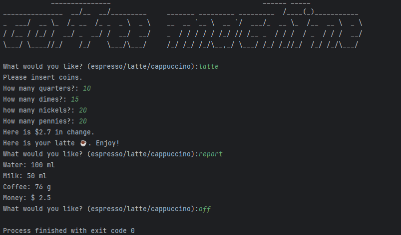

# Coffee Machine Simulator


A Python-based coffee machine simulator that allows users to order different types of coffee, manage resources, and handle monetary transactions.

## Features

- Order different types of coffee (espresso, latte, cappuccino)
- Process coin payments (quarters, dimes, nickels, pennies)
- Track and manage resources (water, milk, coffee)
- Generate reports of current resource levels and profits
- Provide change for transactions
- Check resource availability before processing orders

## How It Works

The program simulates a coffee machine with the following functionality:

1. Takes drink orders from users (espresso/latte/cappuccino)
2. Checks if there are sufficient resources to make the drink
3. Processes coins and calculates total money inserted
4. Provides change if necessary
5. Makes the drink by deducting resources
6. Updates profit tracking

## Commands

- `espresso`: Order an espresso
- `latte`: Order a latte
- `cappuccino`: Order a cappuccino
- `report`: Display current resource levels and profit
- `off`: Turn off the coffee machine

## Functions

### `calculate_money(quarters, dimes, nickles, pennies)`
Calculates the total value of inserted coins.

### `check_money(order, t_money)`
Verifies if sufficient money was inserted for the selected drink.

### `check_ingredients(order_ing)`
Checks if there are enough resources to make the selected drink.

### `get_change(t_money, order_cost)`
Calculates the change to return to the customer.

### `reduce_resources(order_ing)`
Updates resource levels after making a drink.

### `coffee_machine()`
Main function that runs the coffee machine simulation.

## Dependencies

The program requires two additional files:
- `coffee_machine_data.py`: Contains `MENU` and `resources` data
- `art.py`: Contains the `logo` for the coffee machine

## Usage

To run the coffee machine simulator:

```python
python coffee_machine.py
```

Follow the prompts to:
1. Select your drink
2. Insert coins when prompted
3. Receive your drink and change (if applicable)

## Resource Management

The machine tracks:
- Water (in ml)
- Milk (in ml)
- Coffee (in g)
- Money (in $)

Resources are automatically deducted when drinks are made, and the program prevents orders when resources are insufficient.
